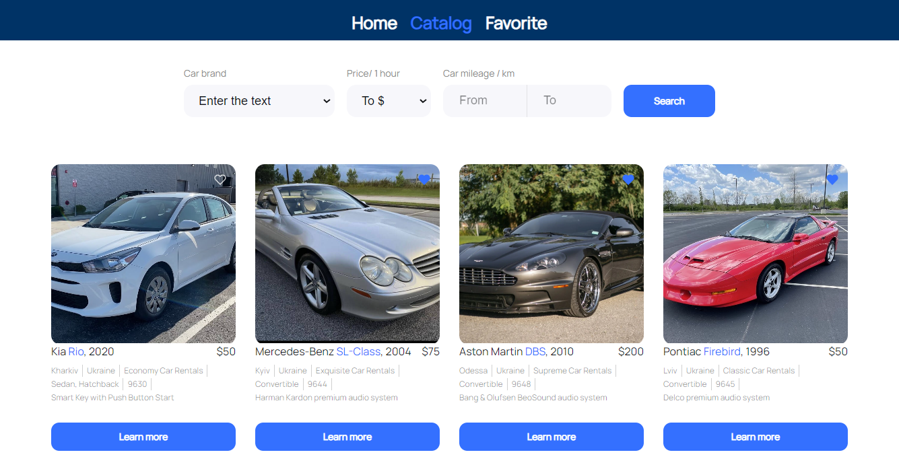

<h1 align="center"> Rent a Car </h1>

## Description

The car rental site in Ukraine is an online platform designed for convenient car rental in different regions of Ukraine. The following is a general description of the possible sections and features that can be found on such a site:

## Home page

Information about the service and its benefits.

#### In the future, it is planned to implement:

Search for available cars (specify location, rental and return dates).
In the project directory, you can run:

## Car search

Filters for accurate car selection (make, model, body type, engine volume, fuel, etc.).
View a list of available cars with photos and descriptions.

For each car in the list, the user can click on the <h3>Learn more</h3> button, which opens a window with detailed information about the car, including photos, specifications, rental conditions and other details.

If you click on the heart, the car is added to the favorites page.

When you click on the <h3>Rental Car</h3> button, you will be automatically connected to the rental department.

#### In the future, it is planned to implement:

Calculation of the rental cost based on the selected parameters.

## Favorite

The "Favorite" page on the car rental website is a personal section where users can save and track cars they like or are interested in for future rental.
The user will see a list of cars that he has added to his favorite list. Each car is displayed with a picture, name, basic characteristics (make, model, body type) and the current rental price.

For each car in the favorites list, the user can click on the <h3>Learn more</h3> button, which opens a window with detailed information about the car, including photos, specifications, rental conditions and other details.

When you click on the <h3>Rental Car</h3> button, you will be automatically connected to the rental department.
